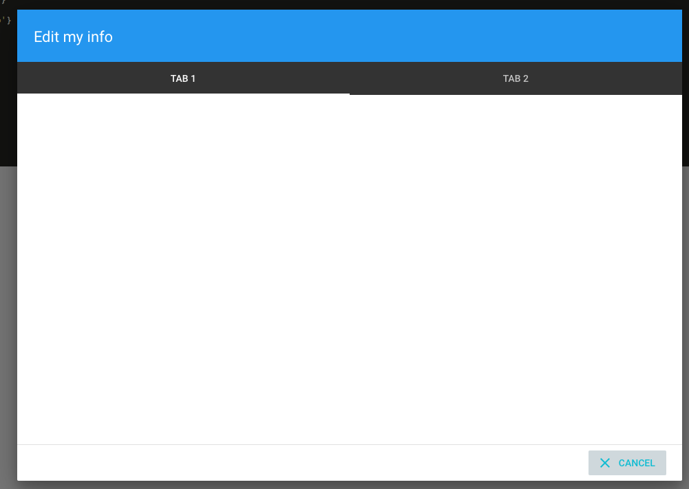

# TabDialog [Repo](https://github.com/React-Quiver/TabDialog)

TabDialog written with React.

## Getting started
```
npm install
npm start
```

## Description
A multitab dialog system that manages async action on user's button clicks.



## Documentation
Check the complete documentation and working example in React-Quiver doc website.
